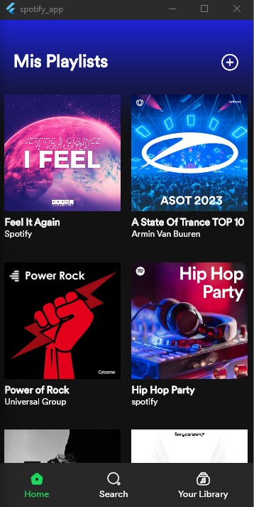
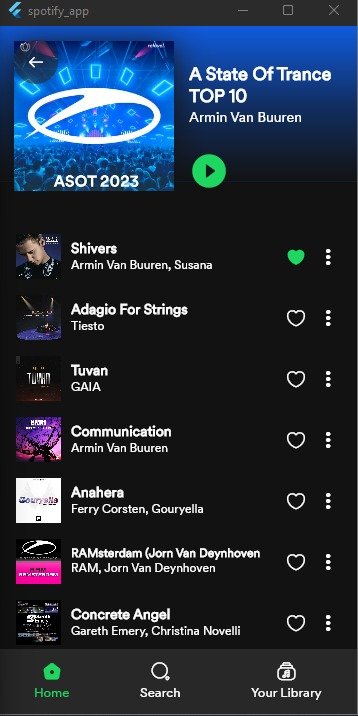
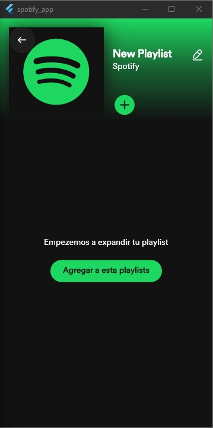
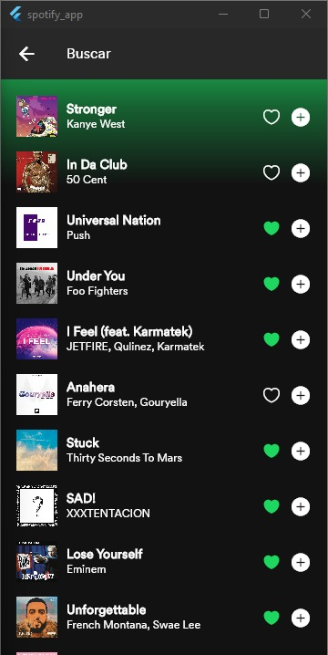

## Spotify Flite - Small clone Spotify in Flutter

## Screenshots

Home Page             |  Playlist Songs Page 1
:-------------------------:|:-------------------------:
||

Create Playlist Page            |  Search Songs Page
:-------------------------:|:-------------------------:
||

## Getting started 
* In lib/core/utils/constants.dart change "Your_Ip" for your local IP

## Backend
* [ Click here](https://github.com/eduuuJS/spotify_app_backend)

## Contributors
* [eduuuJS](https://github.com/eduuuJS)